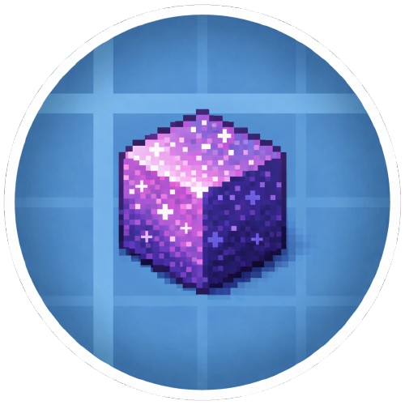

# Create: Gravitated



Create: Gravitated is a NeoForge addon for Create Aeronautics that adds control blocks for easier ship building.

It is aimed at the "I want my contraption to behave" part of the experience:

- `Gravitite` cancels gravity for the contraption it is attached to.
- `Stabilite` levels a contraption toward the horizon without freezing normal motion.
- A steering wheel placed on top of Stabilite can drive ship yaw directly.
- In-game Ponder scenes explain Gravitite, Stabilite, steering wheel yaw, and redstone control.
- Side tip: Honey Glue range can be configured with `/creategravitated honey_glue_range`.

## Features

### Gravitite

- Zero-gravity support for Create Aeronautics contraptions
- Redstone-controlled strength
- White shimmer particles, ambient hum, and animated blue visuals

### Stabilite

- Horizon stabilization with redstone-scaled rigidity
- Purple visuals and particles
- Helm yaw input when a steering wheel is mounted above the block

### Building tweaks

- Configurable Honey Glue range with `/creategravitated honey_glue_range`
- New Ponder tutorials for both addon control blocks
- Tooltip styling and polished presentation assets for the new blocks

## Requirements

- Minecraft `1.21.1`
- NeoForge `21.1.x`
- [Create](https://modrinth.com/mod/create)
- [Create Aeronautics](https://modrinth.com/mod/create-aeronautics)

The release jar is built as an addon. It is not a replacement for Create Aeronautics.

## Building

From the repository root:

```powershell
.\gradlew :aeronautics-addon:neoforge:build
```

Built jars land in:

```text
aeronautics-addon/neoforge/build/libs/
```

## Release

Current release line:

- `1.0.3-gravitated.4`

Primary jar name:

- `create-gravitated-neoforge-1.21.1-1.0.3-gravitated.4.jar`

## License

This repository uses the Simulated Project license layout:

- code is MIT
- project assets are All Rights Reserved

See [LICENSE.md](./LICENSE.md) for the exact terms.
